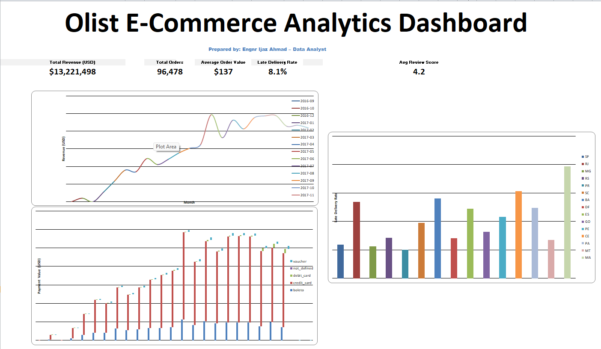

# 🛒 Olist E-Commerce Analytics (SQL + Python + Excel)

End-to-end e-commerce analytics project using the **Olist Brazilian E-Commerce public dataset** (orders, customers, payments, items, products, sellers, reviews, geolocation).  
Dataset source: Kaggle “Brazilian E-Commerce Public Dataset by Olist”.

## What this project delivers
- **SQLite analytics database** built from the raw CSVs
- **Reporting layer (SQL views)**: order enrichment, delivery SLA, seller KPIs, customer lifetime KPIs
- **KPI extracts (CSV)** for dashboards
- **Python analysis**: RFM segmentation + cohort retention exports
- **Excel dashboard-ready outputs**

## Repo layout
```
olist-ecommerce-analytics/
├─ data/                 # download instructions + (optional) small sample
├─ sql/                  # schema, views, KPIs
├─ python/               # ETL + KPI export scripts
├─ notebooks/            # optional analysis notebooks (templates)
├─ reports/              # executive summary + KPI definitions
├─ assets/images/        # screenshots for GitHub + your portfolio website
└─ excel/                # dashboard instructions
```

## Quick start (SQLite)

### 1) Get the dataset
Follow `data/README.md` and place CSVs into:
```
data/raw/brazilian-ecommerce/
```

### 2) Create DB + load CSVs
```bash
python -m venv .venv
# Windows: .venv\Scripts\activate
# macOS/Linux: source .venv/bin/activate
pip install -r requirements.txt

python python/etl_load_sqlite.py --data-dir data/raw/brazilian-ecommerce --db data/olist.sqlite
```

### 3) Build reporting views + export KPIs
```bash
python python/build_reporting_layer.py --db data/olist.sqlite
python python/export_kpis.py --db data/olist.sqlite --out data/processed/kpis
python python/rfm_cohorts.py --db data/olist.sqlite --out data/processed/kpis
```

## Outputs for Excel dashboard
- `kpi_orders_monthly.csv`
- `kpi_delivery_sla_state.csv`
- `kpi_seller_performance.csv`
- `kpi_category_performance.csv`
- `kpi_payment_mix_monthly.csv`
- `kpi_customer_rfm.csv`
- `kpi_cohort_retention.csv`

## Author
Add your name + contacts here.
## Dashboard Preview

